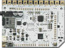

ofxTouchBoard
=============



Introduction
------------
This addon helps you receive data from the Bare Conductive's Touch Board in a simple and convenient way.

License
-------
[MIT License](https://en.wikipedia.org/wiki/MIT_License), see license.md.

Installation
------------
Just drop the folder into the `openFrameworks/addons/` folder.
To receive data from your Touch Board you need to upload the [`DataStream`](https://github.com/BareConductive/mpr121/tree/public/MPR121/Examples/DataStream) program on it.

Usage
-----

See the examples for how to use this addon in your app.
The following methods are available:

```
setup()
```
Setup the Touch Board. This method will ask you the device id of your Touch Board (don't use this if you have multiple Touch Boards).
	
```	
setup(int deviceId)
```
Setup the Touch Board corrresponding to `deviceId` (use this when using multiple Touch Boards).

```
update()
```
Update the data received from the Touch Board, call this every frame.

```
getTouchStatus()
```
Get a vector of boolean containing the touch status of each electrode of the Touch Board.

```
draw(float x, float y)
```
Draw a bar graph with filtered data and baseline value.
	
```
ofEvent<int> touched
```
Touch event you can register to.

```
ofEvent<int> released
```
Release event you can register to.

```
getData()
```
Get a vector of `ofxTB::Electrode` containing normalized data.

Other available methods:

```
logData()
```
Log data to the console.

```
printData(float x, float y)
```
Print an array of data from the Touch Board (normalized between 0.0 and 1.0).

```
printRawData(float x, float y)
```
Print an array of raw data from the Touch Board.

```
useBoardThresholds(bool b)
```
Use thresholds from the Touch Board or from the addon to detect touch and release.
	
```
getRawData()
```
Get a vector of `ofxTB::Electrode` containing raw data.

```
getTouchThresholds()
```
Get a vector of `ofParameter<float>` corresponding to the touch thresholds of the addon.
	
```
getReleaseThresholds()
```
Get a vector of `ofParameter<float>` corresponding to the release thresholds of the addon.	

```
getTouchThresholdsParams()
```
Get an `ofParameterGroup` containing the touch thresholds of the addon (easy to use with ofxGui).

```
getReleaseThresholdsParams()
```
Get an `ofParameterGroup` containing the release thresholds of the addon (easy to use with ofxGui).


Dependencies
------------
None for the addon. ofxGui for the examples.

Compatibility
------------
This addon works with oF 0.8.4 on Linux and Mac OS X.

Known issues
------------
Don't setup your boards with `setup()` when using multiple boards, use `setup(int deviceId)` instead. 

<!-- Version history
------------
It make sense to include a version history here (newest releases first), describing new features and changes to the addon. Use [git tags](http://learn.github.com/p/tagging.html) to mark release points in your repo, too!

### Version 0.1 (Date):
Describe relevant changes etc. -->